> **<u>Documentación y guía paso a paso de</u>**

**<u>Sistema ABM Librería</u>**

Tabla de contenido

<table>
<thead>
<tr class="header">
<th>1.</th>
<th><blockquote>

Introduccion

</blockquote></th>
<th></th>
</tr>
</thead>
<tbody>
<tr class="odd">
<td>2.</td>
<td><blockquote>

1.1.

</blockquote></td>
<td><blockquote>

Alcance

</blockquote></td>
</tr>
<tr class="even">
<td></td>
<td><blockquote>

1.2.

</blockquote></td>
<td><blockquote>

Comportamiento

</blockquote></td>
</tr>
<tr class="odd">
<td></td>
<td><blockquote>

1.3.

</blockquote></td>
<td><blockquote>

Maqueta (Previsualización)

</blockquote></td>
</tr>
<tr class="even">
<td></td>
<td>2. Reproducción paso a paso del sistema</td>
<td></td>
</tr>
<tr class="odd">
<td></td>
<td><blockquote>

2.1.

</blockquote></td>
<td><blockquote>

Introducción de herramientas a utilizar

</blockquote></td>
</tr>
<tr class="even">
<td></td>
<td><blockquote>

2.2.

</blockquote></td>
<td><blockquote>

Configuración del área de trabajo

</blockquote></td>
</tr>
<tr class="odd">
<td></td>
<td><blockquote>

2.3.

</blockquote></td>
<td><blockquote>

Creación de la estructura MVC

</blockquote></td>
</tr>
<tr class="even">
<td></td>
<td><blockquote>

2.4.

</blockquote></td>
<td><blockquote>

Desarrollo de apartado visual (vista.py)

</blockquote></td>
</tr>
<tr class="odd">
<td></td>
<td>2.4.1.</td>
<td><blockquote>

Sector Principal

</blockquote></td>
</tr>
<tr class="even">
<td></td>
<td>2.4.2.</td>
<td><blockquote>

Listado de registros

</blockquote></td>
</tr>
<tr class="odd">
<td></td>
<td>2.4.3.</td>
<td><blockquote>

Sector de búsqueda/filtro

</blockquote></td>
</tr>
<tr class="even">
<td></td>
<td><blockquote>

2.5.

</blockquote></td>
<td><blockquote>

Lógica del sistema (modelo.py)

</blockquote></td>
</tr>
</tbody>
</table>

***1.* Introduccion**

1.1 Alcance

> La finalidad de la aplicación a desarrollar es la de mantener un
> control del catálogo de los libros e historietas presentes dentro de
> una librería.
>
> Para esto se pensó una aplicación en donde se ingresen los siguientes
> datos:  
> ● Titulo: Titulo comercial del libro  
> ● Precio: Valor en pesos del producto  
> ● Editorial: La empresa que produjo ese libro  
> ● Genero: Genero literario del libro  
> ● Autor: Escritor del libro

1.2 Comportamiento

> La aplicación se compone de seis campos de ingreso de texto junto a
> seis etiquetas que se encargan de describir cada uno de estos campos,
> a su vez, la aplicación cuenta con un listado en
>
> donde se exhiben todos los registros guardados y una serie de cinco
> botones que se comportan según se describe a  
> continuación:  
> ● Guardar: Almacena los datos ingresados en los campos de entrada
> dentro de la Base de Datos.
>
> ● Actualizar: Edita y guarda un registro seleccionado desde la lista
> de libros.
>
> ● Eliminar: Elimina desde la Base de Datos al registro seleccionado en
> el listado.
>
> ● Buscar: Muestra un listado de registros que tengan un títuloparecido
> o igual al ingresado dentro del campo de texto“Buscar por título”.
>
> ● Borrar filtro: Muestra el listado completo de registros y limpia el
> campo de texto “Buscar por título”
>
> 1.3 Maqueta (Previsualización)

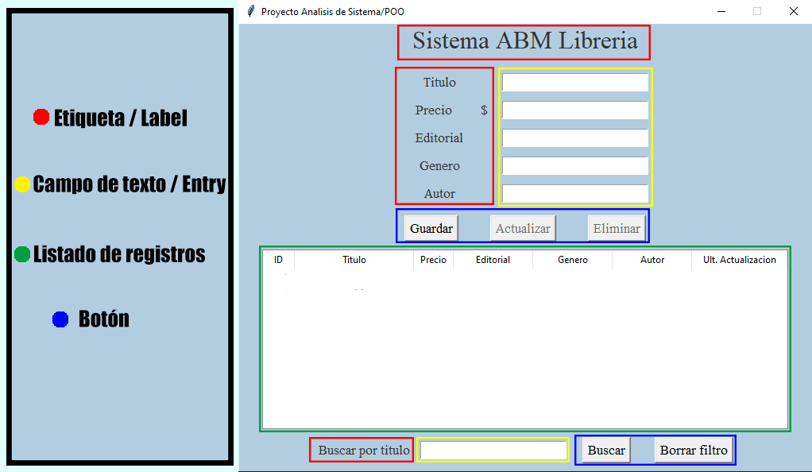

***2.* Reproducción paso a paso**

**del Sistema**

> 2.1 Introducción de herramientas a utilizar
>
> Esta es una breve introducción a las herramientas que utilizo a lo
> largo del desarrollo de este sistema:
>
> ● Visual Studio Code: editor de texto en donde voy a  
> programar el sistema utilizando el lenguaje de programación Python.
>
> ● Dentro de Python utilizo las siguientes librerías:
>
> ● Tkinter: interfaz gráfica por la cual el usuario se va a
>
> poder comunicar con el sistema
>
> ● SQLite3: motor de bases de datos SQL ligero donde
>
> almacenaremos los datos ingresados
>
> ● re: módulo que proporciona operaciones de  
> coincidencia de expresiones regulares (utilizado en las validaciones
> de ingreso de datos)  
> ● Datetime: módulo que proporciona clases para  
> manipular fechas y horas
>
> 2.2 Configuración del área de trabajo
>
> El primer paso al momento de configurar el área de trabajos es el de
> descargar Visual Studio Code, para eso hay que dirigirse a la pagina
> https://code.visualstudio.com/download en donde hay que hacer click en
> el enlace de descarga correspondiente a nuestro sistema operativo:
>
> 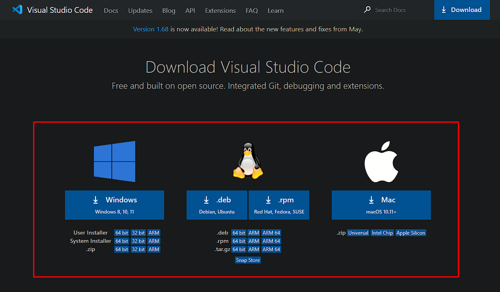
>
> El siguiente paso es el de descargar Python por lo que me voy a
> dirigir ir al siguiente enlace: y hacer click en el botón de descarga
> de la versión más reciente
>
> 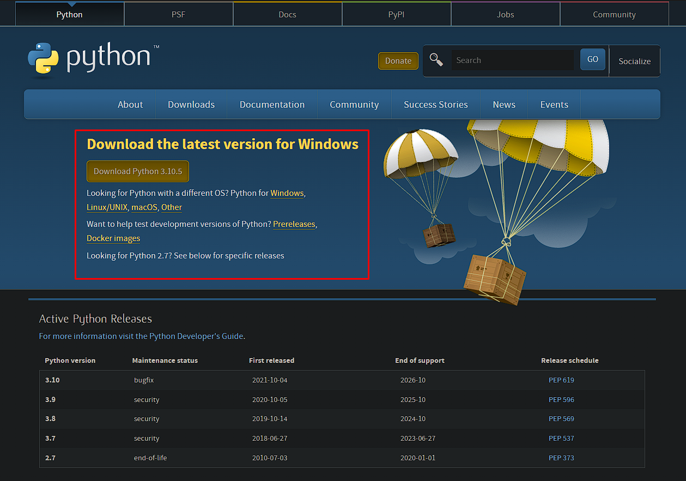
>
> Mientras hago la instalación de Python es muy importante que se tilde
> la opción de “Add Python 3.X to PATH” como muestra la imagen a
> continuación. Si no se realiza este paso, es muy  
> probable que tenga problemas de compatibilidad a futuro.
>
> 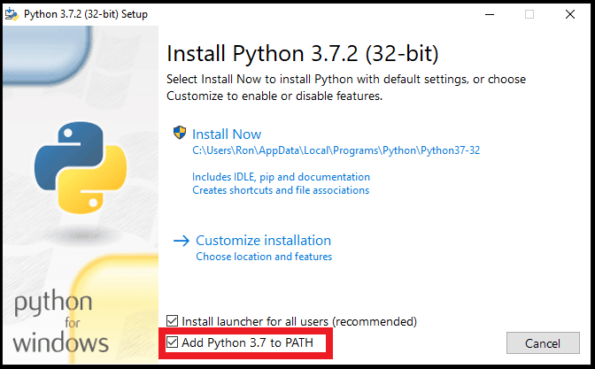
>
> El último paso a la hora de crear el espacio de trabajo es el de poder
> utilizar Python dentro de Visual Studio Code. Para eso voy a abrir VS
> Code y me voy a dirigir a la sección de extensiones
>
> 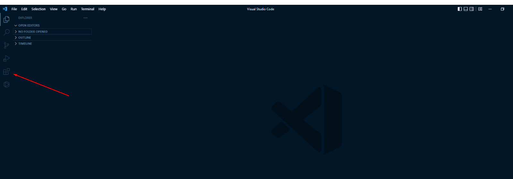
>
> Y dentro de esta sección voy a utilizar el buscador indicado a
> continuación para encontrar e instalar las extensiones que dejo más
> adelante:
>
> 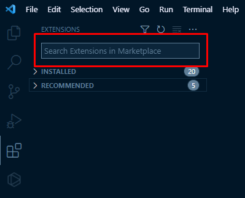
>
> \- Code Runner
>
> 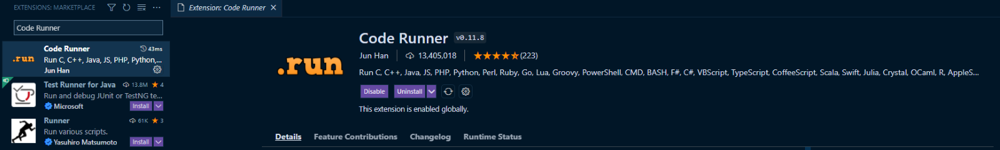
>
> \- Python
>
> 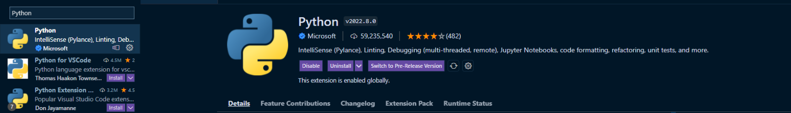
>
> 2.3 Creación de la estructura MVC
>
> Luego de seguir los anteriores pasos ya debería contar tanto con VS
> Code como con Python instalados y funcionando en mi computadora así
> que el siguiente paso es el diseñar la base o arquitectura del
> programa.
>
> En este caso la arquitectura del sistema va a estar basadaen el patrón
> MVC (Modelo-Vista-Controlador) en el cual cuento con un archivo
> “Vista” que es por donde el usuario se va a comunicar con el sistema,
> un archivo “Modelo” que es el que contiene gran parte de la lógica de
> nuestro sistema y un archivo“Controlador” que se encarga de comunicar
> a la Vista con el Modelo.
>
> Lo primero que hago dentro del Visual Studio Code es crear tres
> archivos que compondrán al modelo MVC y los titulo de la siguiente
> manera:
>
> \- “main.py” como nuestro Controlador  
> - “modelo.py” como nuestro Modelo  
> - “Vista.py” como nuestra Vista
>
> 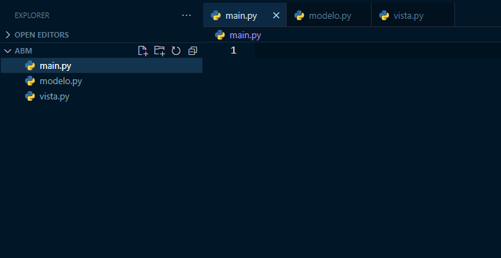
>
> 2.4 Desarrollo del apartado visual (vista.py)
>
> Voy a separar la parte visual del programa en tres partes para una
> mejor comprensión del código. Esta división se encuentra graficada a
> continuación:
>
> 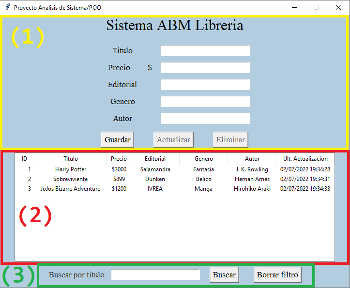

**(1) Sector principal**

**(2) Listado de Registros**

**(3) Sector de búsqueda/filtro**

2.4.1 Sector Principal

> Abro el archivo “vista.py” en donde voy a importar tres librerías que
> traen varias funcionalidades para el desarrollo del apartado visual
> del sistema. Las librerías a importar son las siguientes:
>
> ● Tkinter: Es el paquete más utilizado para crear interfacesgráficas
> en Python, es la herramienta que nos permite crear las etiquetas,
> botones, campos de texto y hasta la misma ventana donde el usuario
> interactúa con el sistema.
>
> ● Tkfont: Utilizada para modificar la fuente del texto dentro de los
> elementos de Tkinter.
>
> ● Tkinter.Ttk: extensión del paquete Tkinter que me permite crear el
> listado registros
>
> 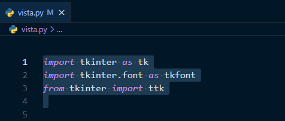
>
> Luego voy a crear una clase con nombre “Panel” que tendrá un método de
> instancia (método que se llama al momento de instanciar a la clase)
> que recibe los siguientes parámetros:
>
> ● self: Hace referencia a la instancia del objeto
>
> ● ventana: Hace referencia a un objeto “tk” que va a servir como
>
> la ventana donde se posicionan los elementos visuales
>
> ● objeto\_modelo: Hace referencia a un objeto de la clase “Abmc”que
> voy a crear más adelante. Me permite interactuar con la parte lógica
> del programa

<table>
<thead>
<tr class="header">
<th><table>
<tbody>
<tr class="odd">
<td>#<em>Clase que se encarga del apartado visual del programa</em></td>
</tr>
</tbody>
</table></th>
</tr>
</thead>
<tbody>
<tr class="odd">
<td>class Panel():</td>
</tr>
<tr class="even">
<td><blockquote>

# <em>Metodo de instacia de la clase Panel</em>

</blockquote></td>
</tr>
<tr class="odd">
<td><blockquote>

def __init__(self, ventana, objeto_modelo):

</blockquote></td>
</tr>
</tbody>
</table>

> Y ahora voya realizar las configuraciones básicas de la ventana y las
> declaraciones de las variables que se van a utilizar dentro de la
> misma:

<table>
<thead>
<tr class="header">
<th>#<em>Clase que se encarga del apartado visual del programa</em></th>
</tr>
</thead>
<tbody>
<tr class="odd">
<td>class Panel():</td>
</tr>
<tr class="even">
<td><blockquote>

# <em>Metodo de instacia de la clase Panel</em>

</blockquote></td>
</tr>
<tr class="odd">
<td><blockquote>

def __init__(self, ventana, objeto_modelo):

</blockquote></td>
</tr>
<tr class="even">
<td><blockquote>

# <em>Creo una variable de instancia root y la cargo con nuestro objeto tk</em>

</blockquote></td>
</tr>
<tr class="odd">
<td><blockquote>

<em>"ventana" que determina la ventana sobore la que estamos trabajando</em>

</blockquote></td>
</tr>
<tr class="even">
<td><blockquote>

self.root = ventana

</blockquote></td>
</tr>
<tr class="odd">
<td><blockquote>

# <em>Configuro el titulo de la ventana sobre la que trabajo</em>

</blockquote></td>
</tr>
<tr class="even">
<td><blockquote>

self.root.title("Proyecto Analisis de Sistema/POO")

</blockquote></td>
</tr>
<tr class="odd">
<td><blockquote>

# <em>Este metodo hace que el tamaño de la ventana no se pueda modificar en</em>

</blockquote></td>
</tr>
<tr class="even">
<td><blockquote>

<em>ninguno de los dos ejes</em>

</blockquote></td>
</tr>
<tr class="odd">
<td><blockquote>

self.root.resizable(False, False)

</blockquote></td>
</tr>
<tr class="even">
<td><blockquote>

# <em>Declaro y cargo una variable para almacenar el color de fondo del</em>

</blockquote></td>
</tr>
<tr class="odd">
<td><blockquote>

<em>sistema</em>

</blockquote></td>
</tr>
</tbody>
</table>

<table>
<thead>
<tr class="header">
<th><table>
<tbody>
<tr class="odd">
<td><blockquote>

self.color_fondo = tk.StringVar()

</blockquote></td>
</tr>
</tbody>
</table></th>
</tr>
</thead>
<tbody>
<tr class="odd">
<td><blockquote>

self.color_fondo.set("#b3cde0")

</blockquote></td>
</tr>
<tr class="even">
<td><blockquote>

# <em>Configuro el color de fondo de la ventana utilizando la variable</em>

</blockquote></td>
</tr>
<tr class="odd">
<td><blockquote>

self.root.configure(bg=self.color_fondo.get())

</blockquote></td>
</tr>
<tr class="even">
<td><blockquote>

# <em>Declaracion de variables a utilizar dentro del sistema</em>

</blockquote></td>
</tr>
<tr class="odd">
<td><blockquote>

# <em>Cada una de estas variables va a ser referenciada dentro de un campo de</em>

</blockquote></td>
</tr>
<tr class="even">
<td><blockquote>

<em>texto/Entry</em>

</blockquote></td>
</tr>
<tr class="odd">
<td><blockquote>

self.var_titulo = tk.StringVar()

</blockquote></td>
</tr>
<tr class="even">
<td><blockquote>

self.var_precio = tk.StringVar()

</blockquote></td>
</tr>
<tr class="odd">
<td><blockquote>

self.var_editorial = tk.StringVar()

</blockquote></td>
</tr>
<tr class="even">
<td><blockquote>

self.var_genero = tk.StringVar()

</blockquote></td>
</tr>
<tr class="odd">
<td><blockquote>

self.var_autor = tk.StringVar()

</blockquote></td>
</tr>
<tr class="even">
<td><blockquote>

self.var_id = tk.StringVar()

</blockquote></td>
</tr>
<tr class="odd">
<td><blockquote>

self.var_busqueda = tk.StringVar()

</blockquote></td>
</tr>
</tbody>
</table>

> Luego declaro los “tk.Frame”. Este objeto representa un contenedor con
> un área rectangular en donde se pueden agrupar y organizar los
> elementos dentro de la ventana del sistema

<table>
<thead>
<tr class="header">
<th><table>
<tbody>
<tr class="odd">
<td><blockquote>

# <em>Declaro los frames donde van a ir ubicado los widgets del sistema</em>

</blockquote></td>
</tr>
</tbody>
</table></th>
</tr>
</thead>
<tbody>
<tr class="odd">
<td><blockquote>

self.frame_central = tk.Frame(

</blockquote></td>
</tr>
<tr class="even">
<td><blockquote>

self.root, bg=self.color_fondo.get())

</blockquote></td>
</tr>
<tr class="odd">
<td><blockquote>

self.frame_entry = tk.Frame(

</blockquote></td>
</tr>
<tr class="even">
<td><blockquote>

self.frame_central, bg=self.color_fondo.get())

</blockquote></td>
</tr>
<tr class="odd">
<td><blockquote>

self.frame_entryprecio = tk.Frame(

</blockquote></td>
</tr>
<tr class="even">
<td><blockquote>

self.frame_entry, bg=self.color_fondo.get())

</blockquote></td>
</tr>
<tr class="odd">
<td><blockquote>

self.frame_botones = tk.Frame(

</blockquote></td>
</tr>
<tr class="even">
<td><blockquote>

self.frame_central, bg=self.color_fondo.get())

</blockquote></td>
</tr>
<tr class="odd">
<td><blockquote>

self.frame_tree = tk.Frame(

</blockquote></td>
</tr>
</tbody>
</table>

<table>
<thead>
<tr class="header">
<th><table>
<tbody>
<tr class="odd">
<td><blockquote>

self.frame_central, bg=self.color_fondo.get())

</blockquote></td>
</tr>
</tbody>
</table></th>
</tr>
</thead>
<tbody>
<tr class="odd">
<td><blockquote>

self.frame_buscar = tk.Frame(

</blockquote></td>
</tr>
<tr class="even">
<td><blockquote>

self.frame_central, bg=self.color_fondo.get())

</blockquote></td>
</tr>
</tbody>
</table>

> Ahora paso a declarar las Label o Etiquetas principales que sirven
> como guía para el usuario a la hora de poder ingresar información.

<table>
<thead>
<tr class="header">
<th><table>
<tbody>
<tr class="odd">
<td><blockquote>

# <em>Declaración de las etiquetas que componen al sector inicial de nuestro</em>

</blockquote></td>
</tr>
</tbody>
</table></th>
</tr>
</thead>
<tbody>
<tr class="odd">
<td><blockquote>

<em>programa</em>

</blockquote></td>
</tr>
<tr class="even">
<td><blockquote>

# <em>El primer parametro es la ubicación en donde se va a posicionar el</em>

</blockquote></td>
</tr>
<tr class="odd">
<td><blockquote>

<em>elemento</em>

</blockquote></td>
</tr>
<tr class="even">
<td><blockquote>

# <em>El parametro "bg" determina el color de fondo del elemento</em>

</blockquote></td>
</tr>
<tr class="odd">
<td><blockquote>

# <em>El parametro "text" determina el texto que va a tener nuestro elemento</em>

</blockquote></td>
</tr>
<tr class="even">
<td><blockquote>

# <em>El parametro "font" indica la fuente de este elemento</em>

</blockquote></td>
</tr>
<tr class="odd">
<td><blockquote>

self.sistema_label = tk.Label(

</blockquote></td>
</tr>
<tr class="even">
<td><blockquote>

self.root,

</blockquote></td>
</tr>
<tr class="odd">
<td><blockquote>

bg=self.color_fondo.get(),

</blockquote></td>
</tr>
<tr class="even">
<td><blockquote>

text="Sistema ABM Libreria",

</blockquote></td>
</tr>
<tr class="odd">
<td><blockquote>

font=tkfont.Font(family="Times", size=23),

</blockquote></td>
</tr>
<tr class="even">
<td><blockquote>

)

</blockquote></td>
</tr>
<tr class="odd">
<td><blockquote>

self.titulo_label = tk.Label(

</blockquote></td>
</tr>
<tr class="even">
<td><blockquote>

self.frame_entry,

</blockquote></td>
</tr>
<tr class="odd">
<td><blockquote>

bg=self.color_fondo.get(),

</blockquote></td>
</tr>
<tr class="even">
<td><blockquote>

text="Titulo",

</blockquote></td>
</tr>
<tr class="odd">
<td><blockquote>

font=tkfont.Font(family="Times", size=13),

</blockquote></td>
</tr>
<tr class="even">
<td><blockquote>

)

</blockquote></td>
</tr>
<tr class="odd">
<td><blockquote>

self.editorial_label = tk.Label(

</blockquote></td>
</tr>
<tr class="even">
<td><blockquote>

self.frame_entry,

</blockquote></td>
</tr>
<tr class="odd">
<td><blockquote>

bg=self.color_fondo.get(),

</blockquote></td>
</tr>
<tr class="even">
<td><blockquote>

text="Editorial",

</blockquote></td>
</tr>
<tr class="odd">
<td><blockquote>

font=tkfont.Font(family="Times", size=13),

</blockquote></td>
</tr>
<tr class="even">
<td><blockquote>

)

</blockquote></td>
</tr>
<tr class="odd">
<td><blockquote>

self.simbolopeso_label = tk.Label(

</blockquote></td>
</tr>
<tr class="even">
<td><blockquote>

self.frame_entryprecio,

</blockquote></td>
</tr>
<tr class="odd">
<td><blockquote>

bg=self.color_fondo.get(),

</blockquote></td>
</tr>
</tbody>
</table>

<table>
<thead>
<tr class="header">
<th><table>
<tbody>
<tr class="odd">
<td><blockquote>

text="$",

</blockquote></td>
</tr>
</tbody>
</table></th>
</tr>
</thead>
<tbody>
<tr class="odd">
<td><blockquote>

font=tkfont.Font(family="Times", size=13),

</blockquote></td>
</tr>
<tr class="even">
<td><blockquote>

)

</blockquote></td>
</tr>
<tr class="odd">
<td><blockquote>

self.precio_label = tk.Label(

</blockquote></td>
</tr>
<tr class="even">
<td><blockquote>

self.frame_entryprecio,

</blockquote></td>
</tr>
<tr class="odd">
<td><blockquote>

bg=self.color_fondo.get(),

</blockquote></td>
</tr>
<tr class="even">
<td><blockquote>

text="Precio",

</blockquote></td>
</tr>
<tr class="odd">
<td><blockquote>

font=tkfont.Font(family="Times", size=13),

</blockquote></td>
</tr>
<tr class="even">
<td><blockquote>

)

</blockquote></td>
</tr>
<tr class="odd">
<td><blockquote>

self.genero_label = tk.Label(

</blockquote></td>
</tr>
<tr class="even">
<td><blockquote>

self.frame_entry,

</blockquote></td>
</tr>
<tr class="odd">
<td><blockquote>

bg=self.color_fondo.get(),

</blockquote></td>
</tr>
<tr class="even">
<td><blockquote>

text="Genero",

</blockquote></td>
</tr>
<tr class="odd">
<td><blockquote>

font=tkfont.Font(family="Times", size=13),

</blockquote></td>
</tr>
<tr class="even">
<td><blockquote>

)

</blockquote></td>
</tr>
<tr class="odd">
<td><blockquote>

self.autor_label = tk.Label(

</blockquote></td>
</tr>
<tr class="even">
<td><blockquote>

self.frame_entry,

</blockquote></td>
</tr>
<tr class="odd">
<td><blockquote>

bg=self.color_fondo.get(),

</blockquote></td>
</tr>
<tr class="even">
<td><blockquote>

text="Autor",

</blockquote></td>
</tr>
<tr class="odd">
<td><blockquote>

font=tkfont.Font(family="Times", size=13),

</blockquote></td>
</tr>
<tr class="even">
<td><blockquote>

)

</blockquote></td>
</tr>
</tbody>
</table>

> Creo los campos de entrada que le permiten ingresar datos en el
> sistema al usuario y van a estar ubicados al lado de sus  
> etiquetas/labels correspondientes

<table>
<thead>
<tr class="header">
<th><table>
<tbody>
<tr class="odd">
<td><blockquote>

# <em>Declaración de las campos de texto que componen al sector inicial de</em>

</blockquote></td>
</tr>
</tbody>
</table></th>
</tr>
</thead>
<tbody>
<tr class="odd">
<td><blockquote>

<em>nuestro programa</em>

</blockquote></td>
</tr>
<tr class="even">
<td><blockquote>

# <em>El primer parametro es la ubicacion en donde se va a pocisionar el</em>

</blockquote></td>
</tr>
<tr class="odd">
<td><blockquote>

<em>elemento</em>

</blockquote></td>
</tr>
<tr class="even">
<td><blockquote>

# <em>El parametro "textvariable" determina la variable en donde se va a</em>

</blockquote></td>
</tr>
<tr class="odd">
<td><blockquote>

<em>almacenar la informacion de nuestro Entry</em>

</blockquote></td>
</tr>
<tr class="even">
<td><blockquote>

# <em>El parametro "font" indica la fuente de este elemento</em>

</blockquote></td>
</tr>
<tr class="odd">
<td><blockquote>

self.titulo_entry = tk.Entry(

</blockquote></td>
</tr>
<tr class="even">
<td><blockquote>

self.frame_entry,

</blockquote></td>
</tr>
</tbody>
</table>

<table>
<thead>
<tr class="header">
<th><table>
<tbody>
<tr class="odd">
<td><blockquote>

textvariable=self.var_titulo,

</blockquote></td>
</tr>
</tbody>
</table></th>
</tr>
</thead>
<tbody>
<tr class="odd">
<td><blockquote>

font=tkfont.Font(family="Times", size=13),

</blockquote></td>
</tr>
<tr class="even">
<td><blockquote>

)

</blockquote></td>
</tr>
<tr class="odd">
<td><blockquote>

self.precio_entry = tk.Entry(

</blockquote></td>
</tr>
<tr class="even">
<td><blockquote>

self.frame_entry,

</blockquote></td>
</tr>
<tr class="odd">
<td><blockquote>

textvariable=self.var_precio,

</blockquote></td>
</tr>
<tr class="even">
<td><blockquote>

font=tkfont.Font(family="Times", size=13),

</blockquote></td>
</tr>
<tr class="odd">
<td><blockquote>

)

</blockquote></td>
</tr>
<tr class="even">
<td><blockquote>

self.editorial_entry = tk.Entry(

</blockquote></td>
</tr>
<tr class="odd">
<td><blockquote>

self.frame_entry,

</blockquote></td>
</tr>
<tr class="even">
<td><blockquote>

textvariable=self.var_editorial,

</blockquote></td>
</tr>
<tr class="odd">
<td><blockquote>

font=tkfont.Font(family="Times", size=13),

</blockquote></td>
</tr>
<tr class="even">
<td><blockquote>

)

</blockquote></td>
</tr>
<tr class="odd">
<td><blockquote>

self.gen_entry = tk.Entry(

</blockquote></td>
</tr>
<tr class="even">
<td><blockquote>

self.frame_entry,

</blockquote></td>
</tr>
<tr class="odd">
<td><blockquote>

textvariable=self.var_genero,

</blockquote></td>
</tr>
<tr class="even">
<td><blockquote>

font=tkfont.Font(family="Times", size=13),

</blockquote></td>
</tr>
<tr class="odd">
<td><blockquote>

)

</blockquote></td>
</tr>
<tr class="even">
<td><blockquote>

self.autor_entry = tk.Entry(

</blockquote></td>
</tr>
<tr class="odd">
<td><blockquote>

self.frame_entry,

</blockquote></td>
</tr>
<tr class="even">
<td><blockquote>

textvariable=self.var_autor,

</blockquote></td>
</tr>
<tr class="odd">
<td><blockquote>

font=tkfont.Font(family="Times", size=13),

</blockquote></td>
</tr>
<tr class="even">
<td><blockquote>

)

</blockquote></td>
</tr>
</tbody>
</table>

> Creo los botones principales del programa que son
> “Guardar”,“Actualizar” y “Eliminar”. Cada uno de estos botones va a
> llamar a una función que voy a declarar más adelante en el módulo
> “Modelo”donde se encuentra la lógica del programa

<table>
<thead>
<tr class="header">
<th><table>
<tbody>
<tr class="odd">
<td><blockquote>

# <em>Botones del sector principal</em>

</blockquote></td>
</tr>
</tbody>
</table></th>
</tr>
</thead>
<tbody>
<tr class="odd">
<td><blockquote>

#<em>El primer parametro de cada boton determina su ubicacion</em>

</blockquote></td>
</tr>
</tbody>
</table>

<table>
<thead>
<tr class="header">
<th><table>
<tbody>
<tr class="odd">
<td><blockquote>

#<em>El parametro "state" determina si el boton es clickeable o no</em>

</blockquote></td>
</tr>
</tbody>
</table></th>
</tr>
</thead>
<tbody>
<tr class="odd">
<td><blockquote>

#<em>Boton Eliminar</em>

</blockquote></td>
</tr>
<tr class="even">
<td><blockquote>

#<em>Llama a la funcion "funcion_baja" que crearemos mas adelante en el</em>

</blockquote></td>
</tr>
<tr class="odd">
<td><em>modulo "modelo"</em></td>
</tr>
<tr class="even">
<td><blockquote>

self.borrar_boton = tk.Button(

</blockquote></td>
</tr>
<tr class="odd">
<td><blockquote>

self.frame_botones,

</blockquote></td>
</tr>
<tr class="even">
<td><blockquote>

command=lambda: objeto_modelo.funcion_baja(

</blockquote></td>
</tr>
<tr class="odd">
<td><blockquote>

self.var_id.get(),

</blockquote></td>
</tr>
<tr class="even">
<td><blockquote>

self.upd_boton,

</blockquote></td>
</tr>
<tr class="odd">
<td><blockquote>

self.borrar_boton,

</blockquote></td>
</tr>
<tr class="even">
<td><blockquote>

self.tree,

</blockquote></td>
</tr>
<tr class="odd">
<td><blockquote>

self.var_titulo,

</blockquote></td>
</tr>
<tr class="even">
<td><blockquote>

self.var_precio,

</blockquote></td>
</tr>
<tr class="odd">
<td><blockquote>

self.var_editorial,

</blockquote></td>
</tr>
<tr class="even">
<td><blockquote>

self.var_genero,

</blockquote></td>
</tr>
<tr class="odd">
<td><blockquote>

self.var_autor,

</blockquote></td>
</tr>
<tr class="even">
<td><blockquote>

self.var_busqueda,

</blockquote></td>
</tr>
<tr class="odd">
<td><blockquote>

),

</blockquote></td>
</tr>
<tr class="even">
<td><blockquote>

font=tkfont.Font(family="Times", size=13),

</blockquote></td>
</tr>
<tr class="odd">
<td><blockquote>

text="Eliminar",

</blockquote></td>
</tr>
<tr class="even">
<td><blockquote>

state="disabled",

</blockquote></td>
</tr>
<tr class="odd">
<td><blockquote>

)

</blockquote></td>
</tr>
<tr class="even">
<td><blockquote>

# <em>Boton guardar</em>

</blockquote></td>
</tr>
<tr class="odd">
<td><blockquote>

# <em>Llama a la funcion "funcion_alta" que crearemos mas adelante en el</em>

</blockquote></td>
</tr>
<tr class="even">
<td><em>modulo "modelo"</em></td>
</tr>
<tr class="odd">
<td><blockquote>

self.g_boton = tk.Button(

</blockquote></td>
</tr>
<tr class="even">
<td><blockquote>

self.frame_botones,

</blockquote></td>
</tr>
<tr class="odd">
<td><blockquote>

command=lambda: objeto_modelo.funcion_alta(

</blockquote></td>
</tr>
<tr class="even">
<td><blockquote>

self.var_titulo,

</blockquote></td>
</tr>
<tr class="odd">
<td><blockquote>

self.var_precio,

</blockquote></td>
</tr>
<tr class="even">
<td><blockquote>

self.var_editorial,

</blockquote></td>
</tr>
<tr class="odd">
<td><blockquote>

self.var_genero,

</blockquote></td>
</tr>
<tr class="even">
<td><blockquote>

self.var_autor,

</blockquote></td>
</tr>
</tbody>
</table>

<table>
<thead>
<tr class="header">
<th><table>
<tbody>
<tr class="odd">
<td><blockquote>

self.upd_boton,

</blockquote></td>
</tr>
</tbody>
</table></th>
</tr>
</thead>
<tbody>
<tr class="odd">
<td><blockquote>

self.borrar_boton,

</blockquote></td>
</tr>
<tr class="even">
<td><blockquote>

self.var_busqueda,

</blockquote></td>
</tr>
<tr class="odd">
<td><blockquote>

self.tree,

</blockquote></td>
</tr>
<tr class="even">
<td><blockquote>

),

</blockquote></td>
</tr>
<tr class="odd">
<td><blockquote>

font=tkfont.Font(family="Times", size=13),

</blockquote></td>
</tr>
<tr class="even">
<td><blockquote>

text="Guardar",

</blockquote></td>
</tr>
<tr class="odd">
<td><blockquote>

)

</blockquote></td>
</tr>
<tr class="even">
<td><blockquote>

# <em>Boton guardar</em>

</blockquote></td>
</tr>
<tr class="odd">
<td><blockquote>

# <em>Llama a la funcion "funcion_alta" que crearemos mas adelante en el</em>

</blockquote></td>
</tr>
<tr class="even">
<td><em>modulo "modelo"</em></td>
</tr>
<tr class="odd">
<td><blockquote>

self.upd_boton = tk.Button(

</blockquote></td>
</tr>
<tr class="even">
<td><blockquote>

self.frame_botones,

</blockquote></td>
</tr>
<tr class="odd">
<td><blockquote>

command=lambda: objeto_modelo.funcion_modificar(

</blockquote></td>
</tr>
<tr class="even">
<td><blockquote>

self.var_id,

</blockquote></td>
</tr>
<tr class="odd">
<td><blockquote>

self.var_titulo,

</blockquote></td>
</tr>
<tr class="even">
<td><blockquote>

self.var_precio,

</blockquote></td>
</tr>
<tr class="odd">
<td><blockquote>

self.var_editorial,

</blockquote></td>
</tr>
<tr class="even">
<td><blockquote>

self.var_genero,

</blockquote></td>
</tr>
<tr class="odd">
<td><blockquote>

self.var_autor,

</blockquote></td>
</tr>
<tr class="even">
<td><blockquote>

self.upd_boton,

</blockquote></td>
</tr>
<tr class="odd">
<td><blockquote>

self.borrar_boton,

</blockquote></td>
</tr>
<tr class="even">
<td><blockquote>

self.var_busqueda,

</blockquote></td>
</tr>
<tr class="odd">
<td><blockquote>

self.tree,

</blockquote></td>
</tr>
<tr class="even">
<td><blockquote>

),

</blockquote></td>
</tr>
<tr class="odd">
<td><blockquote>

font=tkfont.Font(family="Times", size=13),

</blockquote></td>
</tr>
<tr class="even">
<td><blockquote>

text="Actualizar",

</blockquote></td>
</tr>
<tr class="odd">
<td><blockquote>

state="disabled",

</blockquote></td>
</tr>
<tr class="even">
<td><blockquote>

)

</blockquote></td>
</tr>
</tbody>
</table>

> Y el último paso para dentro del sector en donde se hace el ingreso de
> datos es el de ubicar los elementos que cree previamente. Para eso voy
> a utilizar el método “grid” que me permite ubicar cada elemento dentro
> de una grilla imaginaria dentro de la ventana.
>
> Los parámetros “row” y “column” determinan en qué fila ycolumna se va
> a posicionar cada elemento de la grilla, mientras que los parámetros
> “padx” y “pady” permiten mover al elemento dentro del eje X e Y para
> un posicionamiento más preciso.

<table>
<thead>
<tr class="header">
<th><table>
<tbody>
<tr class="odd">
<td><blockquote>

self.frame_central.grid(row=1, column=0)

</blockquote></td>
</tr>
</tbody>
</table></th>
</tr>
</thead>
<tbody>
<tr class="odd">
<td><blockquote>

self.frame_entry.grid(row=0, column=0)

</blockquote></td>
</tr>
<tr class="even">
<td><blockquote>

self.frame_botones.grid(row=1, column=0)

</blockquote></td>
</tr>
<tr class="odd">
<td><blockquote>

self.frame_tree.grid(row=2, column=0)

</blockquote></td>
</tr>
<tr class="even">
<td><blockquote>

self.frame_buscar.grid(row=3, column=0)

</blockquote></td>
</tr>
<tr class="odd">
<td><blockquote>

self.sistema_label.grid(row=0, column=0)

</blockquote></td>
</tr>
<tr class="even">
<td><blockquote>

self.titulo_label.grid(row=1, column=0, padx=15, pady=(20, 5))

</blockquote></td>
</tr>
<tr class="odd">
<td><blockquote>

self.titulo_entry.grid(row=1, column=1, padx=15, pady=(20, 5))

</blockquote></td>
</tr>
<tr class="even">
<td><blockquote>

self.frame_entryprecio.grid(row=2, column=0, padx=(30, 0))

</blockquote></td>
</tr>
<tr class="odd">
<td><blockquote>

self.precio_label.grid(row=0, column=0, pady=5, padx=(0, 30))

</blockquote></td>
</tr>
<tr class="even">
<td><blockquote>

self.simbolopeso_label.grid(row=0, column=1)

</blockquote></td>
</tr>
<tr class="odd">
<td><blockquote>

self.precio_entry.grid(row=2, column=1)

</blockquote></td>
</tr>
<tr class="even">
<td><blockquote>

self.editorial_label.grid(row=3, column=0, pady=5)

</blockquote></td>
</tr>
<tr class="odd">
<td><blockquote>

self.editorial_entry.grid(row=3, column=1)

</blockquote></td>
</tr>
<tr class="even">
<td><blockquote>

self.genero_label.grid(row=4, column=0, pady=5)

</blockquote></td>
</tr>
<tr class="odd">
<td><blockquote>

self.gen_entry.grid(row=4, column=1)

</blockquote></td>
</tr>
<tr class="even">
<td><blockquote>

self.autor_label.grid(row=5, column=0, pady=5)

</blockquote></td>
</tr>
<tr class="odd">
<td><blockquote>

self.autor_entry.grid(row=5, column=1)

</blockquote></td>
</tr>
</tbody>
</table>

<table>
<thead>
<tr class="header">
<th><table>
<tbody>
<tr class="odd">
<td><blockquote>

self.g_boton.grid(row=0, column=0, padx=30, pady=10)

</blockquote></td>
</tr>
</tbody>
</table></th>
</tr>
</thead>
<tbody>
<tr class="odd">
<td><blockquote>

self.upd_boton.grid(row=0, column=1, padx=10, pady=10)

</blockquote></td>
</tr>
<tr class="even">
<td><blockquote>

self.borrar_boton.grid(row=0, column=2, padx=30, pady=10)

</blockquote></td>
</tr>
</tbody>
</table>

2.4.2 Listado de registros

> Para la creación del listado voy a usar el objeto
> “Treeview”perteneciente a la librería “ttk”.
>
> Un dato a aclarar es que los treeview vienen con una columnapor
> default (normalmente llamada “ghost column” o “columna fantasma”) y
> voy a utilizar esa columna para almacenar el “ID” de cada elemento,
> por eso no se declara la columna “ID” dentro del array de columnas
> “self.columnas”.

<table>
<thead>
<tr class="header">
<th><table>
<tbody>
<tr class="odd">
<td><blockquote>

#<em>Declaro un array con nombres para identificar a cada columna</em>

</blockquote></td>
</tr>
</tbody>
</table></th>
</tr>
</thead>
<tbody>
<tr class="odd">
<td><blockquote>

self.columnas = ("titulo", "precio", "editorial",

</blockquote></td>
</tr>
<tr class="even">
<td>"genero", "autor", "fecha_upd")</td>
</tr>
<tr class="odd">
<td><blockquote>

#<em>Creo el listado treeview y le paso como parametros la ubicacion</em>

</blockquote></td>
</tr>
<tr class="even">
<td><blockquote>

<em>en donde va a estar pocisionado</em>

</blockquote></td>
</tr>
<tr class="odd">
<td><blockquote>

#<em>y el listado de las columnas</em>

</blockquote></td>
</tr>
<tr class="even">
<td><blockquote>

self.tree = ttk.Treeview(self.frame_tree, columns=self.columnas)

</blockquote></td>
</tr>
<tr class="odd">
<td><blockquote>

#<em>Declaro los heading o encabezados de la lista y le asigno un</em>

</blockquote></td>
</tr>
<tr class="even">
<td><blockquote>

<em>nombre</em>

</blockquote></td>
</tr>
<tr class="odd">
<td><blockquote>

self.tree.heading("#0", text="ID")

</blockquote></td>
</tr>
<tr class="even">
<td><blockquote>

#<em>Modifico la configuracion de la columna correspondiente a cada</em>

</blockquote></td>
</tr>
<tr class="odd">
<td><blockquote>

<em>encabezado</em>

</blockquote></td>
</tr>
<tr class="even">
<td><blockquote>

#<em>-minwidth determina el ancho minimo que puede tener la columna</em>

</blockquote></td>
</tr>
<tr class="odd">
<td>#<em>-width determina el ancho predeterminado de la columna</em></td>
</tr>
<tr class="even">
<td><blockquote>

#<em>-anchor determina como ubico el texto dentro de la columna, en</em>

</blockquote></td>
</tr>
<tr class="odd">
<td><blockquote>

<em>este caso el texto estaria centrado</em>

</blockquote></td>
</tr>
</tbody>
</table>

<table>
<thead>
<tr class="header">
<th><table>
<tbody>
<tr class="odd">
<td><blockquote>

self.tree.column("#0", minwidth=0, width=40, anchor="center")

</blockquote></td>
</tr>
</tbody>
</table></th>
</tr>
</thead>
<tbody>
<tr class="odd">
<td><blockquote>

self.tree.heading("titulo", text="Titulo")

</blockquote></td>
</tr>
<tr class="even">
<td><blockquote>

self.tree.column("titulo", minwidth=0, width=150, anchor="center")

</blockquote></td>
</tr>
<tr class="odd">
<td><blockquote>

self.tree.heading("precio", text="Precio")

</blockquote></td>
</tr>
<tr class="even">
<td><blockquote>

self.tree.column("precio", minwidth=0, width=50, anchor="center")

</blockquote></td>
</tr>
<tr class="odd">
<td><blockquote>

self.tree.heading("editorial", text="Editorial")

</blockquote></td>
</tr>
<tr class="even">
<td><blockquote>

self.tree.column("editorial", minwidth=0, width=100,

</blockquote></td>
</tr>
<tr class="odd">
<td>anchor="center")</td>
</tr>
<tr class="even">
<td><blockquote>

self.tree.heading("genero", text="Genero")

</blockquote></td>
</tr>
<tr class="odd">
<td><blockquote>

self.tree.column("genero", minwidth=0, width=100, anchor="center")

</blockquote></td>
</tr>
<tr class="even">
<td><blockquote>

self.tree.heading("autor", text="Autor")

</blockquote></td>
</tr>
<tr class="odd">
<td><blockquote>

self.tree.column("autor", minwidth=0, width=100, anchor="center")

</blockquote></td>
</tr>
<tr class="even">
<td><blockquote>

self.tree.heading("fecha_upd", text="Ult. Actualizacion")

</blockquote></td>
</tr>
<tr class="odd">
<td><blockquote>

self.tree.column("fecha_upd", minwidth=0, width=120,

</blockquote></td>
</tr>
<tr class="even">
<td>anchor="center")</td>
</tr>
<tr class="odd">
<td><blockquote>

#<em>Pocisiono el listado tree dentro de la grilla</em>

</blockquote></td>
</tr>
<tr class="even">
<td><blockquote>

self.tree.grid(row=0, column=0, padx=30)

</blockquote></td>
</tr>
</tbody>
</table>

> Luego creo un evento utilizando el método “bind” que me permite
> ejecutar una función cada vez que el usuario hace click en el listado

<table>
<thead>
<tr class="header">
<th><table>
<tbody>
<tr class="odd">
<td><blockquote>

# <em>Evento que se acciona cuando hago click en un item del treeview</em>

</blockquote></td>
</tr>
</tbody>
</table></th>
</tr>
</thead>
<tbody>
<tr class="odd">
<td><blockquote>

self.tree.bind(

</blockquote></td>
</tr>
<tr class="even">
<td><blockquote>

"&lt;&lt;TreeviewSelect&gt;&gt;",

</blockquote></td>
</tr>
<tr class="odd">
<td><blockquote>

lambda event: objeto_modelo.select_item(

</blockquote></td>
</tr>
<tr class="even">
<td><blockquote>

self.tree.item(self.tree.focus()),

</blockquote></td>
</tr>
<tr class="odd">
<td><blockquote>

self.var_id,

</blockquote></td>
</tr>
</tbody>
</table>

<table>
<thead>
<tr class="header">
<th><table>
<tbody>
<tr class="odd">
<td>)</td>
</tr>
</tbody>
</table></th>
<th>),</th>
<th><blockquote>

self.var_titulo,

</blockquote></th>
</tr>
</thead>
<tbody>
<tr class="odd">
<td></td>
<td></td>
<td><blockquote>

self.var_precio,

</blockquote></td>
</tr>
<tr class="even">
<td></td>
<td></td>
<td><blockquote>

self.var_editorial,

</blockquote></td>
</tr>
<tr class="odd">
<td></td>
<td></td>
<td><blockquote>

self.var_genero,

</blockquote></td>
</tr>
<tr class="even">
<td></td>
<td></td>
<td><blockquote>

self.var_autor,

</blockquote></td>
</tr>
<tr class="odd">
<td></td>
<td></td>
<td><blockquote>

self.borrar_boton,

</blockquote></td>
</tr>
<tr class="even">
<td></td>
<td></td>
<td><blockquote>

self.upd_boton,

</blockquote></td>
</tr>
</tbody>
</table>

> Y por último llamo a un método que voy a crear más adelante y que me
> permite mostrar los registros ingresados dentro del listado Treeview.

<table>
<thead>
<tr class="header">
<th><table>
<tbody>
<tr class="odd">
<td><blockquote>

# <em>Llamo a funcion para popular la lista</em>

</blockquote></td>
</tr>
</tbody>
</table></th>
</tr>
</thead>
<tbody>
<tr class="odd">
<td><blockquote>

# <em>Esta funcion solo se llama una vez</em>

</blockquote></td>
</tr>
<tr class="even">
<td>objeto_modelo.cargar_listado(self.tree, self.var_busqueda)</td>
</tr>
</tbody>
</table>

> 2.4.3 Sector de búsqueda/filtro
>
> El último sector a desarrollar en el módulo de vista es el de
> búsqueda/filtro. Este sector está compuesto por:
>
> ● Etiqueta/Label: identificador del campo de entrada .
>
> ● Campo de texto: espacio en donde el usuario puede ingresar el título
> del producto a buscar.
>
> ● Botón “Buscar”: ejecuta un función “cargar\_listado” del
> módulo“modelo” que modifica la información del listado treeview
> dependiendo de los datos ingresados en el campo de texto.
>
> ● Botón “Borrar Filtro”: ejecuta la misma función que el botón
> “Buscar” pero aplicando una lógica distinta que permite vaciar
>
> los campos de entrada y mostrar el listado de registros completos sin
> aplicar filtros.
>
> Asi deberia verse el código que compone al “sector búsqueda” del
> sistema:

<table>
<thead>
<tr class="header">
<th><table>
<tbody>
<tr class="odd">
<td><blockquote>

#<em>Label "Buscar por titulo"</em>

</blockquote></td>
</tr>
</tbody>
</table></th>
</tr>
</thead>
<tbody>
<tr class="odd">
<td><blockquote>

self.buscar_label = tk.Label(

</blockquote></td>
</tr>
<tr class="even">
<td><blockquote>

self.frame_buscar,

</blockquote></td>
</tr>
<tr class="odd">
<td><blockquote>

bg=self.color_fondo.get(),

</blockquote></td>
</tr>
<tr class="even">
<td><blockquote>

text="Buscar por titulo",

</blockquote></td>
</tr>
<tr class="odd">
<td><blockquote>

font=tkfont.Font(family="Times", size=13),

</blockquote></td>
</tr>
<tr class="even">
<td><blockquote>

)

</blockquote></td>
</tr>
<tr class="odd">
<td>#<em>Campo de texto para ingresar titulo utilizado en el filtro</em></td>
</tr>
<tr class="even">
<td><blockquote>

self.buscar_entry = tk.Entry(

</blockquote></td>
</tr>
<tr class="odd">
<td><blockquote>

self.frame_buscar,

</blockquote></td>
</tr>
<tr class="even">
<td><blockquote>

textvariable=self.var_busqueda,

</blockquote></td>
</tr>
<tr class="odd">
<td><blockquote>

font=tkfont.Font(family="Times", size=13),

</blockquote></td>
</tr>
<tr class="even">
<td><blockquote>

)

</blockquote></td>
</tr>
<tr class="odd">
<td><blockquote>

#<em>Boton de busqueda: muestra solo los registros que contengan el</em>

</blockquote></td>
</tr>
<tr class="even">
<td><em>texto del entry "buscar_entry" dentro del listado de registros</em></td>
</tr>
<tr class="odd">
<td><blockquote>

self.busq_boton = tk.Button(

</blockquote></td>
</tr>
<tr class="even">
<td><blockquote>

self.frame_buscar,

</blockquote></td>
</tr>
<tr class="odd">
<td><blockquote>

command=lambda: objeto_modelo.cargar_listado(

</blockquote></td>
</tr>
<tr class="even">
<td><blockquote>

self.tree,

</blockquote></td>
</tr>
<tr class="odd">
<td><blockquote>

self.var_busqueda,

</blockquote></td>
</tr>
<tr class="even">
<td><blockquote>

),

</blockquote></td>
</tr>
<tr class="odd">
<td><blockquote>

font=tkfont.Font(family="Times", size=13),

</blockquote></td>
</tr>
<tr class="even">
<td><blockquote>

text="Buscar",

</blockquote></td>
</tr>
<tr class="odd">
<td><blockquote>

)

</blockquote></td>
</tr>
<tr class="even">
<td><blockquote>

#<em>Boton borrar filtro: vacia campos de texto y reinicia el listado</em>

</blockquote></td>
</tr>
<tr class="odd">
<td><em>de registros</em></td>
</tr>
</tbody>
</table>

<table>
<thead>
<tr class="header">
<th><table>
<tbody>
<tr class="odd">
<td><blockquote>

self.b_filtro_boton = tk.Button(

</blockquote></td>
</tr>
</tbody>
</table></th>
</tr>
</thead>
<tbody>
<tr class="odd">
<td><blockquote>

self.frame_buscar,

</blockquote></td>
</tr>
<tr class="even">
<td><blockquote>

command=lambda: objeto_modelo.cargar_listado(

</blockquote></td>
</tr>
<tr class="odd">
<td><blockquote>

self.tree,

</blockquote></td>
</tr>
<tr class="even">
<td><blockquote>

self.var_busqueda,

</blockquote></td>
</tr>
<tr class="odd">
<td><blockquote>

True,

</blockquote></td>
</tr>
<tr class="even">
<td><blockquote>

),

</blockquote></td>
</tr>
<tr class="odd">
<td><blockquote>

font=tkfont.Font(family="Times", size=13),

</blockquote></td>
</tr>
<tr class="even">
<td><blockquote>

text="Borrar filtro",

</blockquote></td>
</tr>
<tr class="odd">
<td><blockquote>

)

</blockquote></td>
</tr>
<tr class="even">
<td><blockquote>

#<em>Pocisionamiento de la etiquetas, campos de entrada y los botones</em>

</blockquote></td>
</tr>
<tr class="odd">
<td><em>del sector busqueda</em></td>
</tr>
<tr class="even">
<td><blockquote>

self.buscar_label.grid(row=8, column=0, padx=10, pady=10)

</blockquote></td>
</tr>
<tr class="odd">
<td><blockquote>

self.buscar_entry.grid(row=8, column=1, pady=10)

</blockquote></td>
</tr>
<tr class="even">
<td><blockquote>

self.busq_boton.grid(row=8, column=2, padx=20, pady=10)

</blockquote></td>
</tr>
<tr class="odd">
<td>self.b_filtro_boton.grid(row=8, column=3, padx=10, pady=10)</td>
</tr>
</tbody>
</table>

> Con esto ya doy por finalizado el desarrollo del apartado visual del
> programa. Ahora paso a crear la lógica del sistema que me va a
> permitir procesar la información que ingrese el usuario desde el
> apartado visual.
>
> 2.5 Lógica del sistema (modelo.py)
>
> El primer paso a la hora de desarrollar la lógica del programa es el
> de abrir el archivo “modelo.py” previamente creado en el inicio de
>
> esta guía. Dentro de este módulo voy a estar declarando las siguientes
> librerías:

<table>
<thead>
<tr class="header">
<th><table>
<tbody>
<tr class="odd">
<td>#<em>Base de datos que utilizo para almancenar registros</em></td>
</tr>
</tbody>
</table></th>
</tr>
</thead>
<tbody>
<tr class="odd">
<td><em>import</em> sqlite3</td>
</tr>
<tr class="even">
<td>#<em>Libreria que permite utilizar expresiones regulares para validar</em></td>
</tr>
<tr class="odd">
<td><em>informacion</em></td>
</tr>
<tr class="even">
<td><em>import</em> re</td>
</tr>
<tr class="odd">
<td>#<em>Libreria que utilizo para conseguir la fecha y hora exacta al momento de</em></td>
</tr>
<tr class="even">
<td><em>registrar cambios en la base de datos</em></td>
</tr>
<tr class="odd">
<td><em>from</em> datetime <em>import</em> datetime</td>
</tr>
<tr class="even">
<td>#<em>Libreria utilizada para mostrar popups o mensajes de alerta a la hora de</em></td>
</tr>
<tr class="odd">
<td><em>realizar algun cambio en el registro de datos</em></td>
</tr>
<tr class="even">
<td><em>from</em> tkinter <em>import</em> messagebox</td>
</tr>
</tbody>
</table>

> Luego creo la clase “Abmc” y dentro de su método de instancia (“def
> \_\_init\_\_ (self,)”) voy a crear tres variables “regex” que me van a
> servir a la hora de realizar validaciones. Para tener una idea del
> funcionamiento de las “regex” o “expresiones regulares” dejo este link
> a continuacion:

<table>
<thead>
<tr class="header">
<th><table>
<tbody>
<tr class="odd">
<td>#<em>Clase ABMC: maneja la logica relacionada a las funciones de Alta, Baja,</em></td>
</tr>
</tbody>
</table></th>
</tr>
</thead>
<tbody>
<tr class="odd">
<td><em>MOdificacion y Consulta del sistema</em></td>
</tr>
<tr class="even">
<td>class Abmc():</td>
</tr>
<tr class="odd">
<td><blockquote>

#<em>Metodo de instancia</em>

</blockquote></td>
</tr>
<tr class="even">
<td><blockquote>

def __init__(self,):

</blockquote></td>
</tr>
<tr class="odd">
<td><blockquote>

# <em>Matchea con lineas de texto que solo tengan numeros entre 0 y 9</em>

</blockquote></td>
</tr>
<tr class="even">
<td><blockquote>

self.regex_numeros = "^[0-9]+$"

</blockquote></td>
</tr>
<tr class="odd">
<td><blockquote>

# <em>Matchea con lineas de texto que solo tengan caracteres y con una</em>

</blockquote></td>
</tr>
<tr class="even">
<td><em>longitud entre 1 y 60 caracteres</em></td>
</tr>
</tbody>
</table>

<table>
<thead>
<tr class="header">
<th><table>
<tbody>
<tr class="odd">
<td><blockquote>

self.regex_palabra = r"^[.,a-zA-Z\s]{1,60}$"

</blockquote></td>
</tr>
</tbody>
</table></th>
</tr>
</thead>
<tbody>
<tr class="odd">
<td><blockquote>

# <em>Matchea con lineas de texto que tengan caracteres o numeros y</em>

</blockquote></td>
</tr>
<tr class="even">
<td><em>con una longitud entre 1 y 60 caracteres</em></td>
</tr>
<tr class="odd">
<td><blockquote>

self.regex_vacio = r"^[,.a-zA-Z0-9_\s]{1,60}$"

</blockquote></td>
</tr>
</tbody>
</table>

> **Todas las funciones que se creen a continuación van**

**a estar dentro de la clase “Abmc”**

> “crear\_db”: permite conectarse/crear a la base de datos SQLite3 y
> crear la tabla “libros” dentro de esta base:

<table>
<thead>
<tr class="header">
<th><table>
<tbody>
<tr class="odd">
<td><blockquote>

#<em>Funcion que devuelve una conexion a la base de datos</em>

</blockquote></td>
</tr>
</tbody>
</table></th>
</tr>
</thead>
<tbody>
<tr class="odd">
<td><blockquote>

def <em>crear_db</em>(self,):

</blockquote></td>
</tr>
<tr class="even">
<td><blockquote>

#<em>El metodo "connect" de sqlite3 me permite conectarme a una base</em>

</blockquote></td>
</tr>
<tr class="odd">
<td><em>de datos con el nombre que es enviado como parametroo</em></td>
</tr>
<tr class="even">
<td><blockquote>

#<em>En el caso de que haya una base de datos con ese nombre en el</em>

</blockquote></td>
</tr>
<tr class="odd">
<td><em>mismo directorio que el archivo, este metodo nos conecta a esa base de</em></td>
</tr>
<tr class="even">
<td><em>datos</em></td>
</tr>
<tr class="odd">
<td><blockquote>

#<em>En el caso de que NO haya una base de datos con ese nombre, este</em>

</blockquote></td>
</tr>
<tr class="even">
<td><em>metodo crea la base de datos y luegos nos conecta</em></td>
</tr>
<tr class="odd">
<td><blockquote>

basedatos = sqlite3.connect("libreria.db")

</blockquote></td>
</tr>
<tr class="even">
<td><blockquote>

#<em>Devuelvo la referencia a la base de datos</em>

</blockquote></td>
</tr>
<tr class="odd">
<td><blockquote>

<em>return</em> basedatos

</blockquote></td>
</tr>
<tr class="even">
<td><blockquote>

#<em>Funcion para crear la tabla de registros de libros en nuestra base de</em>

</blockquote></td>
</tr>
<tr class="odd">
<td><em>datos</em></td>
</tr>
<tr class="even">
<td><blockquote>

#<em>Toma como parametro a la base de datos que estamos utilizando</em>

</blockquote></td>
</tr>
<tr class="odd">
<td><blockquote>

def <em>crear_tabla_libro</em>(self, basedatos):

</blockquote></td>
</tr>
<tr class="even">
<td><blockquote>

#<em>Consigo la referencia a la base de datos utilizando la funcion de</em>

</blockquote></td>
</tr>
<tr class="odd">
<td><em>conexion</em></td>
</tr>
<tr class="even">
<td><blockquote>

basedatos = self.crear_db()

</blockquote></td>
</tr>
</tbody>
</table>

<table>
<thead>
<tr class="header">
<th><table>
<tbody>
<tr class="odd">
<td><blockquote>

#<em>Creo un objeto cursor que me permite ejecutar sentencias SQL en</em>

</blockquote></td>
</tr>
</tbody>
</table></th>
</tr>
</thead>
<tbody>
<tr class="odd">
<td><em>la base de datos</em></td>
</tr>
<tr class="even">
<td><blockquote>

cursorbdd = basedatos.cursor()

</blockquote></td>
</tr>
<tr class="odd">
<td><blockquote>

#<em>Defino una sentencia SQL que me permite crear la tabla "libros"</em>

</blockquote></td>
</tr>
<tr class="even">
<td><em>si es que no fue creada con anterioridad</em></td>
</tr>
<tr class="odd">
<td><blockquote>

sql = (

</blockquote></td>
</tr>
<tr class="even">
<td><blockquote>

"CREATE TABLE IF NOT EXISTS libros(id INTEGER PRIMARY KEY

</blockquote></td>
</tr>
<tr class="odd">
<td>AUTOINCREMENT,"</td>
</tr>
<tr class="even">
<td><blockquote>

" titulo TEXT,"

</blockquote></td>
</tr>
<tr class="odd">
<td><blockquote>

" precio INTEGER,"

</blockquote></td>
</tr>
<tr class="even">
<td><blockquote>

" editorial TEXT,"

</blockquote></td>
</tr>
<tr class="odd">
<td><blockquote>

" genero TEXT,"

</blockquote></td>
</tr>
<tr class="even">
<td><blockquote>

" autor TEXT,"

</blockquote></td>
</tr>
<tr class="odd">
<td><blockquote>

" fecha_mod DATETIME)"

</blockquote></td>
</tr>
<tr class="even">
<td><blockquote>

)

</blockquote></td>
</tr>
<tr class="odd">
<td><blockquote>

#<em>Ejecuta la sentencia utilizando el cursor</em>

</blockquote></td>
</tr>
<tr class="even">
<td><blockquote>

cursorbdd.execute(sql)

</blockquote></td>
</tr>
<tr class="odd">
<td><blockquote>

#<em>Utilizo el metodo commit para guardar los cambios realizados en</em>

</blockquote></td>
</tr>
<tr class="even">
<td><em>la base de datos</em></td>
</tr>
<tr class="odd">
<td><blockquote>

basedatos.commit()

</blockquote></td>
</tr>
</tbody>
</table>

> “toggle\_botones”: me permite habilitar o deshabilitar los botones de
> actualizar y eliminar según sea necesario. La idea de esta función es
> hacer que los botones previamente mencionados sean clickeables solo si
> el usuario hizo click en un elemento de la lista, en caso  
> contrario, solo el botón de “Agregar” debería poder ser seleccionado.

<table>
<thead>
<tr class="header">
<th><table>
<tbody>
<tr class="odd">
<td><blockquote>

# <em>Funcion para determinar si los botones de actualizacion y borrado se</em>

</blockquote></td>
</tr>
</tbody>
</table></th>
</tr>
</thead>
<tbody>
<tr class="odd">
<td><em>encuentran activos</em></td>
</tr>
</tbody>
</table>

<table>
<thead>
<tr class="header">
<th><table>
<tbody>
<tr class="odd">
<td><blockquote>

# <em>Esta funcion toma como parametros a los objetos boton de</em>

</blockquote></td>
</tr>
</tbody>
</table></th>
</tr>
</thead>
<tbody>
<tr class="odd">
<td><em>actualizacion y boton de borrado; tambien toma un parametro booleano</em></td>
</tr>
<tr class="even">
<td><em>deshabilitar</em></td>
</tr>
<tr class="odd">
<td><blockquote>

def <em>toggle_botones</em>(self, upd_boton, borrar_boton, deshabilitar):

</blockquote></td>
</tr>
<tr class="even">
<td><blockquote>

#<em>Si dehabilitar es "True", deshabilitamos los botones de</em>

</blockquote></td>
</tr>
<tr class="odd">
<td><em>actualizacion y borrado</em></td>
</tr>
<tr class="even">
<td><blockquote>

<em>if</em> deshabilitar:

</blockquote></td>
</tr>
<tr class="odd">
<td><blockquote>

#<em>"state" es un atributo de los botones de Tkinter que</em>

</blockquote></td>
</tr>
<tr class="even">
<td><em>determina si el boton es clickeable o no</em></td>
</tr>
<tr class="odd">
<td><blockquote>

upd_boton["state"] = "disabled"

</blockquote></td>
</tr>
<tr class="even">
<td><blockquote>

borrar_boton["state"] = "disabled"

</blockquote></td>
</tr>
<tr class="odd">
<td><blockquote>

#<em>En el caso de que deshabilitar sea "False", hago que los botones</em>

</blockquote></td>
</tr>
<tr class="even">
<td><em>sean clickeables</em></td>
</tr>
<tr class="odd">
<td><blockquote>

<em>else</em>:

</blockquote></td>
</tr>
<tr class="even">
<td><blockquote>

upd_boton["state"] = "normal"

</blockquote></td>
</tr>
<tr class="odd">
<td><blockquote>

borrar_boton["state"] = "normal"

</blockquote></td>
</tr>
</tbody>
</table>

> “vaciar\_entradas”: resetea los campos de entrada de texto

<table>
<thead>
<tr class="header">
<th><table>
<tbody>
<tr class="odd">
<td># <em>Funcion para vaciar todos los campos de entrada luego de realizar</em></td>
</tr>
</tbody>
</table></th>
</tr>
</thead>
<tbody>
<tr class="odd">
<td><em>una alta, baja o modificacion</em></td>
</tr>
<tr class="even">
<td># <em>Toma como parametro a los entry del sector principal del programa</em></td>
</tr>
<tr class="odd">
<td><blockquote>

def <em>vaciar_entradas</em>(self, titulo, precio, editorial, genero, autor):

</blockquote></td>
</tr>
<tr class="even">
<td><blockquote>

#<em>El metodo "set("") nos permite vaciar cada uno de los campos de</em>

</blockquote></td>
</tr>
<tr class="odd">
<td><em>entrada</em></td>
</tr>
<tr class="even">
<td><blockquote>

titulo.set("")

</blockquote></td>
</tr>
<tr class="odd">
<td><blockquote>

precio.set("")

</blockquote></td>
</tr>
<tr class="even">
<td><blockquote>

editorial.set("")

</blockquote></td>
</tr>
<tr class="odd">
<td><blockquote>

genero.set("")

</blockquote></td>
</tr>
<tr class="even">
<td><blockquote>

autor.set("")

</blockquote></td>
</tr>
</tbody>
</table>

> “select\_item”: permite recibir los datos de los registros
> seleccionados en el listado y a su vez llena los campos de entrada con
> la  
> información recibida

<table>
<thead>
<tr class="header">
<th><table>
<tbody>
<tr class="odd">
<td># <em>Funcion para rellena los entry con datos del item seleccionado en</em></td>
</tr>
</tbody>
</table></th>
</tr>
</thead>
<tbody>
<tr class="odd">
<td><em>treeview</em></td>
</tr>
<tr class="even">
<td><blockquote>

# <em>Toma como parametro al objeto listado, los campos de entrada y los</em>

</blockquote></td>
</tr>
<tr class="odd">
<td><em>botones de borrar y actualizar</em></td>
</tr>
<tr class="even">
<td><blockquote>

def <em>select_item</em>(

</blockquote></td>
</tr>
<tr class="odd">
<td>self, lista, id, titulo, precio, editorial, genero, autor,</td>
</tr>
<tr class="even">
<td>borrar_boton, upd_boton</td>
</tr>
<tr class="odd">
<td><blockquote>

):

</blockquote></td>
</tr>
<tr class="even">
<td><blockquote>

<em>try</em>:

</blockquote></td>
</tr>
<tr class="odd">
<td><blockquote>

# <em>Rellenamos los campos de entrada con los valores del item</em>

</blockquote></td>
</tr>
<tr class="even">
<td><em>seleccionado dentro de la lista</em></td>
</tr>
<tr class="odd">
<td><blockquote>

id.set(lista["text"])

</blockquote></td>
</tr>
<tr class="even">
<td><blockquote>

titulo.set(lista["values"][0])

</blockquote></td>
</tr>
<tr class="odd">
<td><blockquote>

precio.set(lista["values"][1].lstrip("$"))

</blockquote></td>
</tr>
<tr class="even">
<td><blockquote>

editorial.set(lista["values"][2])

</blockquote></td>
</tr>
<tr class="odd">
<td><blockquote>

genero.set(lista["values"][3])

</blockquote></td>
</tr>
<tr class="even">
<td><blockquote>

autor.set(lista["values"][4])

</blockquote></td>
</tr>
<tr class="odd">
<td><blockquote>

<em>except</em> IndexError:

</blockquote></td>
</tr>
<tr class="even">
<td><blockquote>

#<em>En el caso de que haya un error a la hora de conseguir los</em>

</blockquote></td>
</tr>
<tr class="odd">
<td><em>valores del item, se sale de la funcion</em></td>
</tr>
<tr class="even">
<td><blockquote>

<em>return</em>

</blockquote></td>
</tr>
<tr class="odd">
<td><blockquote>

# <em>Habilito los botones de actualizar y eliminar ya que estoy</em>

</blockquote></td>
</tr>
<tr class="even">
<td><em>seleccionando un registro</em></td>
</tr>
<tr class="odd">
<td><blockquote>

self.toggle_botones(upd_boton, borrar_boton, False)

</blockquote></td>
</tr>
</tbody>
</table>

> “Validar\_entrada”: valida los datos ingresados en los campos de
> entrada a la hora de añadir, eliminar o actualizar un registro de la
> base de datos. La validación se hace utilizando las expresiones
> regulares declaradas al principio de nuestra clase “Abmc”

<table>
<thead>
<tr class="header">
<th><table>
<tbody>
<tr class="odd">
<td><blockquote>

# <em>Funcion para validar los campos de entrada de dato teniendo en</em>

</blockquote></td>
</tr>
</tbody>
</table></th>
</tr>
</thead>
<tbody>
<tr class="odd">
<td><em>cuenta diferentes criterios</em></td>
</tr>
</tbody>
</table>

<table>
<thead>
<tr class="header">
<th><table>
<tbody>
<tr class="odd">
<td># <em>Toma como parametro a los campos de entrada del sector principal</em></td>
</tr>
</tbody>
</table></th>
</tr>
</thead>
<tbody>
<tr class="odd">
<td><blockquote>

def <em>validar_entrada</em>(self, titulo, precio, editorial, genero, autor):

</blockquote></td>
</tr>
<tr class="even">
<td><blockquote>

# <em>Cargo los patrones de regex que voy a usar para validar cada</em>

</blockquote></td>
</tr>
<tr class="odd">
<td><em>campo</em></td>
</tr>
<tr class="even">
<td><blockquote>

patron_num = re.compile(self.regex_numeros)

</blockquote></td>
</tr>
<tr class="odd">
<td><blockquote>

patron_text = re.compile(self.regex_palabra)

</blockquote></td>
</tr>
<tr class="even">
<td><blockquote>

patron_vacio = re.compile(self.regex_vacio)

</blockquote></td>
</tr>
<tr class="odd">
<td><blockquote>

# <em>Variable en la que concateno cada campo que tenga un error</em>

</blockquote></td>
</tr>
<tr class="even">
<td><blockquote>

errores = ""

</blockquote></td>
</tr>
<tr class="odd">
<td><blockquote>

#<em>el metodo fullmatch de la libreria regex permite comparar un</em>

</blockquote></td>
</tr>
<tr class="even">
<td><em>string con una expresion regular</em></td>
</tr>
<tr class="odd">
<td><blockquote>

#<em>En este caso estoy verificando si mi string no cumple con las</em>

</blockquote></td>
</tr>
<tr class="even">
<td><em>condiciones de la expresion regular</em></td>
</tr>
<tr class="odd">
<td><blockquote>

<em>if</em> not re.fullmatch(patron_vacio, titulo.get()):

</blockquote></td>
</tr>
<tr class="even">
<td><blockquote>

#<em>En el caso de que no cumpla con esa condicion, agregamos el</em>

</blockquote></td>
</tr>
<tr class="odd">
<td><em>nombre del campo de entrada a nuestro</em></td>
</tr>
<tr class="even">
<td><blockquote>

#<em>string de errores</em>

</blockquote></td>
</tr>
<tr class="odd">
<td><blockquote>

errores += "\n-Titulo"

</blockquote></td>
</tr>
<tr class="even">
<td><blockquote>

<em>if</em> not re.fullmatch(patron_num, precio.get()):

</blockquote></td>
</tr>
<tr class="odd">
<td><blockquote>

errores += "\n-Precio"

</blockquote></td>
</tr>
<tr class="even">
<td><blockquote>

<em>if</em> not re.fullmatch(patron_text, editorial.get()):

</blockquote></td>
</tr>
<tr class="odd">
<td><blockquote>

errores += "\n-Editorial"

</blockquote></td>
</tr>
<tr class="even">
<td><blockquote>

<em>if</em> not re.fullmatch(patron_text, genero.get()):

</blockquote></td>
</tr>
<tr class="odd">
<td><blockquote>

errores += "\n-Genero"

</blockquote></td>
</tr>
<tr class="even">
<td><blockquote>

<em>if</em> not re.fullmatch(patron_text, autor.get()):

</blockquote></td>
</tr>
<tr class="odd">
<td><blockquote>

errores += "\n-Autor"

</blockquote></td>
</tr>
<tr class="even">
<td><blockquote>

# <em>Si la variable error no esta vacia, muestra un mensaje indicando</em>

</blockquote></td>
</tr>
<tr class="odd">
<td><em>los campos que no estan ingresados correctamente</em></td>
</tr>
<tr class="even">
<td><blockquote>

<em>if</em> errores != "":

</blockquote></td>
</tr>
<tr class="odd">
<td><blockquote>

#<em>El metodo showerror de la libreria messagebox permite mostrar</em>

</blockquote></td>
</tr>
<tr class="even">
<td><em>una ventana emergente con los parametros ingresados</em></td>
</tr>
<tr class="odd">
<td><blockquote>

messagebox.showerror(

</blockquote></td>
</tr>
</tbody>
</table>

<table>
<thead>
<tr class="header">
<th><table>
<tbody>
<tr class="odd">
<td><blockquote>

title="Error",

</blockquote></td>
</tr>
</tbody>
</table></th>
</tr>
</thead>
<tbody>
<tr class="odd">
<td><blockquote>

message="Los siguientes campos no se ingresaron

</blockquote></td>
</tr>
<tr class="even">
<td>correctamente: " + errores,</td>
</tr>
<tr class="odd">
<td><blockquote>

)

</blockquote></td>
</tr>
<tr class="even">
<td><blockquote>

<em>return</em> True

</blockquote></td>
</tr>
</tbody>
</table>
